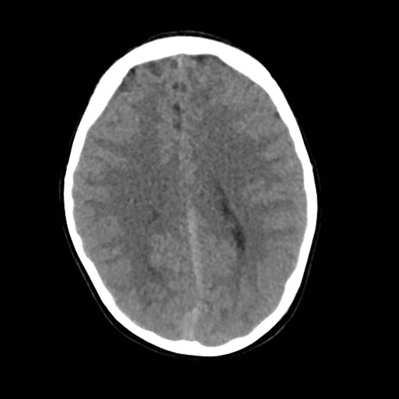
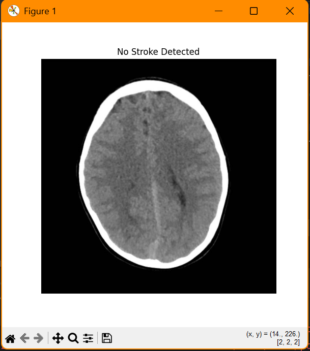
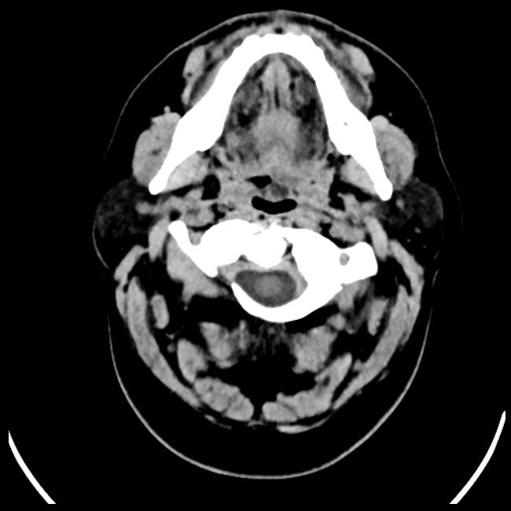
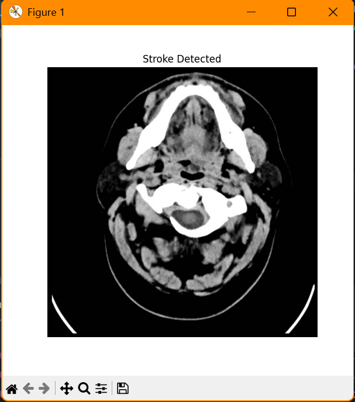

# 🧠 Brain Stroke Detection using Deep Learning

A powerful deep learning-based solution that detects brain strokes from MRI images using convolutional neural networks (CNN). The model takes raw medical imaging data and outputs a high-confidence stroke classification — fast, reliable, and accurate.

> ✅ Trained on high-quality medical image datasets  
> 🧪 Tested on real samples: `test1`, `test2`  
> 🔍 Output visualized as: `result1`, `result2`  

---

## 📸 Sample Inputs and Outputs

| Input MRI | Output Detection |
|----------|------------------|
|  |  |
|  |  |

---

## 🚀 Features

- ✅ MRI image processing and pre-classification
- ✅ Deep learning model (CNN)
- ✅ Real-time prediction capability
- ✅ Clean and modular Python code
- ✅ Easy-to-follow project structure

---

## 🧰 Tech Stack

- Python 3.10  
- TensorFlow / Keras  
- NumPy, OpenCV  
- Matplotlib for visualizations  
- Streamlit (optional for UI)

---

## 📁 Project Structure

```bash
Brain-Stroke-Detection/
├── images/ # Test inputs and outputs
├── model/ # Saved models
├── src/ # Source code files
├── train.py # Model training script
├── predict.py # Stroke prediction script
├── requirements.txt # Required packages
└── README.md # You're here
```


---

## ⚙️ Installation

```bash
git clone https://github.com/n-bharath-chowdary/Brain-Stroke-Detection.git
cd Brain-Stroke-Detection
pip install -r requirements.txt
```
---
## Download the model:

[Click here to download model](https://drive.google.com/file/d/1ozUeNiqD84XrUBG1w25gb8VB1pT5oZtQ/view?usp=sharing)

Place brain_stroke_model.h5 in the project root folder.

---

## ▶️ How to Run

```
run app.py
```
Then, upload a currency image in the web app interface to detect if it's fake or genuine.

---

## 🧪 Algorithms Used

- 🧠 **Convolutional Neural Networks (CNN)** – Core model architecture for image classification  
- 🎛️ **Image Augmentation** – Techniques using OpenCV and Keras to boost dataset diversity  
- 🔁 **Transfer Learning (Optional)** – Plug-and-play pretrained models for faster convergence  
- 🎯 **Softmax Classifier** – Final activation for binary/multi-class stroke prediction

---

## 📄 Project Documents
📘 Final Report: [Fake_Currency_Detection_Report.pdf](https://github.com/n-bharath-chowdary/Brain-Stroke-Detection/blob/HIKe/documents/INTRODUCTION.pdf)

📊 Presentation Slides: Brain-Stroke-Detection-Using-Deep-Learning.pptx

📑 Research Paper: IJEDR2502036.pdf

---

## ✨ Future Enhancements

🔬 Improve classification accuracy with attention-based networks (e.g., Vision Transformers)  
📱 Build a mobile-friendly diagnostic app for stroke detection  
🌐 Deploy on the cloud with real-time API support  
🧠 Integrate segmentation to highlight stroke-affected regions in brain scans  
📊 Add patient metadata support for better contextual predictions

---

## 🙋‍♂️ Author
### Bharath Chowdary

#### [GitHub](https://github.com/n-bharath-chowdary)
#### [LinkedIn](https://www.linkedin.com/in/n-bharath-chowdary/)
